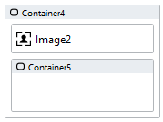
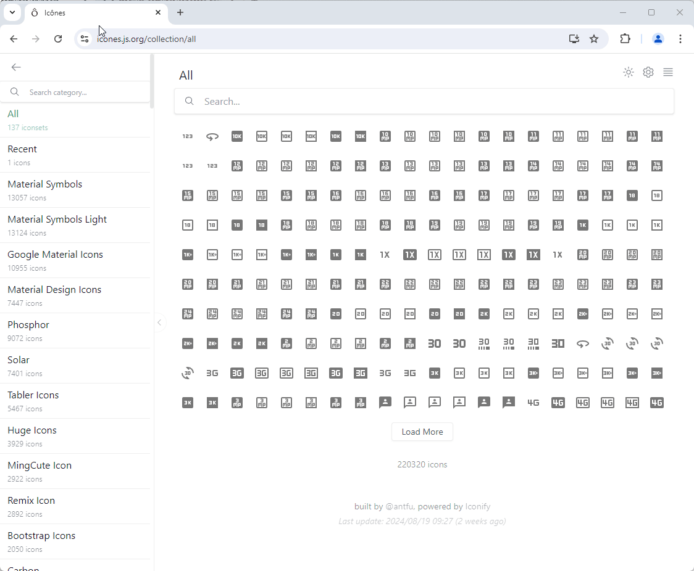

# Spinners

Spinners reduce the perceived waiting time for users. Use spinners to indicate to users that a page or element is busy processing. 


## Version 

1.0 Initial

1.1 Added more spinners (script and CSS)

1.1.1 Added even more spinners (script and CSS)

1.1.2 Added custom spinner option (CSS only)

1.1.3 Added even more spinners (CSS only)

# Setup

## Application Setup
1. Check the *Enable Style Sheet* checkbox in the application properties

## Global Script Setup
1. Create a Global Script called "Spinner"
3. Drag a *JavaScript* action into the script
4. Add the Javascript below into the JavaScript code property
```javascript
/* Stadium Script Version 1.1.3 */
let initSpinners = () => {
    let spinners = document.querySelectorAll(".stadium-spinner");
    let spinnerCount = 115;
    for (let i = 0; i < spinners.length; i++) {
        let arrClasses = spinners[i].getAttribute("class").split(" ");
        let className = arrClasses.find((cl) => cl.startsWith("spinner-type-"));
        if (className) {
            if (className == "spinner-type-random") {
                let randomClass = Math.floor(Math.random() * spinnerCount) + 1;
                className = "spinner-type-" + randomClass;
            }
            spinners[i].classList.remove(className);
            let spinner = document.createElement("div");
            spinner.classList.add(className);
            if (spinners[i].innerHTML != "") console.warn("Spinners must not contain controls");
            spinners[i].innerHTML = "";
            spinners[i].appendChild(spinner);
        }
    }
};
initSpinners();
```

## Spinner Display

### Full-Page Spinner Page Setup
1. Drag a *Container* control to a page and call it "SpinnerContainer"
2. Add the class "stadium-spinner" to the control's classes property
3. Add a class to define the spinner type to the control's classes property (see below)
4. Set the "SpinnerContainer" *Visibility* property to "false" to hide the spinner
5. Set the "SpinnerContainer"*Visibility* property to "true" to show the spinner

### Contained Spinner Page Setup
1. Drag a *Container* control to a page
2. Drag the control the spinner should cover into the *Container* control
3. Drag another *Container* control into the first *Container* control and call it "SpinnerContainer"
4. Add a class to the "SpinnerContainer" classes property to define the spinner type (see below)
5. Set the "SpinnerContainer" *Visibility* property to "false" to hide the spinner
6. Set the "SpinnerContainer"*Visibility* property to "true" to show the spinner

**Contained Spinner Setup**



**Contained Spinner Result**


### Spinner Types
1. Add "spinner-type-1" (or any number between 1 and 114) to the "SpinnerContainer" classes property to select a specific spinner
2. Add "spinner-type-random" to the "SpinnerContainer" classes property to let the script select a random spinner
3. Add "spinner-type-custom" to the "SpinnerContainer" classes property and CSS to your stylesheet to define your own spinner from an animated background image (see below)

**Example Custom Spinner CSS**
```css
.spinner-type-custom {
    /*Sets the spinner background image*/
	background-image: url("data:image/svg+xml,%3Csvg xmlns='http://www.w3.org/2000/svg' width='1em' height='1em' viewBox='0 0 24 24'%3E%3Cg%3E%3Ccircle cx='12' cy='3' r='1' fill='%23ffffff'%3E%3Canimate id='svgSpinners12DotsScaleRotate0' attributeName='r' begin='0;svgSpinners12DotsScaleRotate2.end-0.5s' calcMode='spline' dur='0.6s' keySplines='.27,.42,.37,.99;.53,0,.61,.73' values='1;2;1'/%3E%3C/circle%3E%3Ccircle cx='16.5' cy='4.21' r='1' fill='%23ffffff'%3E%3Canimate id='svgSpinners12DotsScaleRotate1' attributeName='r' begin='svgSpinners12DotsScaleRotate0.begin+0.1s' calcMode='spline' dur='0.6s' keySplines='.27,.42,.37,.99;.53,0,.61,.73' values='1;2;1'/%3E%3C/circle%3E%3Ccircle cx='7.5' cy='4.21' r='1' fill='%23ffffff'%3E%3Canimate id='svgSpinners12DotsScaleRotate2' attributeName='r' begin='svgSpinners12DotsScaleRotate4.begin+0.1s' calcMode='spline' dur='0.6s' keySplines='.27,.42,.37,.99;.53,0,.61,.73' values='1;2;1'/%3E%3C/circle%3E%3Ccircle cx='19.79' cy='7.5' r='1' fill='%23ffffff'%3E%3Canimate id='svgSpinners12DotsScaleRotate3' attributeName='r' begin='svgSpinners12DotsScaleRotate1.begin+0.1s' calcMode='spline' dur='0.6s' keySplines='.27,.42,.37,.99;.53,0,.61,.73' values='1;2;1'/%3E%3C/circle%3E%3Ccircle cx='4.21' cy='7.5' r='1' fill='%23ffffff'%3E%3Canimate id='svgSpinners12DotsScaleRotate4' attributeName='r' begin='svgSpinners12DotsScaleRotate6.begin+0.1s' calcMode='spline' dur='0.6s' keySplines='.27,.42,.37,.99;.53,0,.61,.73' values='1;2;1'/%3E%3C/circle%3E%3Ccircle cx='21' cy='12' r='1' fill='%23ffffff'%3E%3Canimate id='svgSpinners12DotsScaleRotate5' attributeName='r' begin='svgSpinners12DotsScaleRotate3.begin+0.1s' calcMode='spline' dur='0.6s' keySplines='.27,.42,.37,.99;.53,0,.61,.73' values='1;2;1'/%3E%3C/circle%3E%3Ccircle cx='3' cy='12' r='1' fill='%23ffffff'%3E%3Canimate id='svgSpinners12DotsScaleRotate6' attributeName='r' begin='svgSpinners12DotsScaleRotate8.begin+0.1s' calcMode='spline' dur='0.6s' keySplines='.27,.42,.37,.99;.53,0,.61,.73' values='1;2;1'/%3E%3C/circle%3E%3Ccircle cx='19.79' cy='16.5' r='1' fill='%23ffffff'%3E%3Canimate id='svgSpinners12DotsScaleRotate7' attributeName='r' begin='svgSpinners12DotsScaleRotate5.begin+0.1s' calcMode='spline' dur='0.6s' keySplines='.27,.42,.37,.99;.53,0,.61,.73' values='1;2;1'/%3E%3C/circle%3E%3Ccircle cx='4.21' cy='16.5' r='1' fill='%23ffffff'%3E%3Canimate id='svgSpinners12DotsScaleRotate8' attributeName='r' begin='svgSpinners12DotsScaleRotatea.begin+0.1s' calcMode='spline' dur='0.6s' keySplines='.27,.42,.37,.99;.53,0,.61,.73' values='1;2;1'/%3E%3C/circle%3E%3Ccircle cx='16.5' cy='19.79' r='1' fill='%23ffffff'%3E%3Canimate id='svgSpinners12DotsScaleRotate9' attributeName='r' begin='svgSpinners12DotsScaleRotate7.begin+0.1s' calcMode='spline' dur='0.6s' keySplines='.27,.42,.37,.99;.53,0,.61,.73' values='1;2;1'/%3E%3C/circle%3E%3Ccircle cx='7.5' cy='19.79' r='1' fill='%23ffffff'%3E%3Canimate id='svgSpinners12DotsScaleRotatea' attributeName='r' begin='svgSpinners12DotsScaleRotateb.begin+0.1s' calcMode='spline' dur='0.6s' keySplines='.27,.42,.37,.99;.53,0,.61,.73' values='1;2;1'/%3E%3C/circle%3E%3Ccircle cx='12' cy='21' r='1' fill='%23ffffff'%3E%3Canimate id='svgSpinners12DotsScaleRotateb' attributeName='r' begin='svgSpinners12DotsScaleRotate9.begin+0.1s' calcMode='spline' dur='0.6s' keySplines='.27,.42,.37,.99;.53,0,.61,.73' values='1;2;1'/%3E%3C/circle%3E%3CanimateTransform attributeName='transform' dur='6s' repeatCount='indefinite' type='rotate' values='360 12 12;0 12 12'/%3E%3C/g%3E%3C/svg%3E");
    /*Changes the spinner background image size*/
    background-size: 60px;
}
```

**Custom Spinner Selection**
1. Find a spinner here https://icones.js.org/collection/svg-spinners
2. Set the color (e.g. #ffffff)
3. Copy the Data URL option
4. Paste the value into the "url" property in the css below
5. Add the ".spinner-type-custom" style to the stylesheet of your application



## Page.Load Setup
1. Drag the Global Script called "Spinner" to the Page.Load event handler

## Applying the CSS
The CSS below is required for the correct functioning of the module. Some elements can be [customised](#customising-css) using a variables CSS file. 

**Stadium 6.6 or higher**
1. Create a folder called "CSS" inside of your Embedded Files in your application
2. Drag the two CSS files from this repo [*spinner-variables.css*](spinner-variables.css) and [*spinner.css*](spinner.css) into that folder
3. Paste the link tags below into the *head* property of your application
```html
<link rel="stylesheet" href="{EmbeddedFiles}/CSS/spinner.css">
<link rel="stylesheet" href="{EmbeddedFiles}/CSS/spinner-variables.css">
``` 


**Versions lower than 6.6**
1. Copy the CSS from the two css files into the Stylesheet in your application

## Customising CSS
1. Open the CSS file called [*spinner-variables.css*](spinner-variables.css) from this repo
2. Adjust the variables in the *:root* element as you see fit
3. Overwrite the file in the CSS folder of your application with the customised file

## CSS Upgrading
To upgrade the CSS in this module, follow the [steps outlined in this repo](https://github.com/stadium-software/samples-upgrading)
