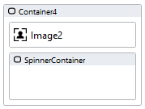

# Spinners

Spinners reduce the perceived waiting time for medium- to long-running processes. Use spinners to indicate to users that a page or element is not accessible for a certain time

https://github.com/stadium-software/spinners/assets/2085324/e71eb0bb-21c6-4962-b3de-e703ca31aa84

## Version 

1.0 Initial

# Setup

## Application Setup
1. Check the *Enable Style Sheet* checkbox in the application properties

## Global Script Setup
1. Create a Global Script called "Spinner"
3. Drag a *JavaScript* action into the script
4. Add the Javascript below into the JavaScript code property
```javascript
/* Stadium Script Version 1.0 */
let initSpinners = () => {
    let spinners = document.querySelectorAll(".stadium-spinner");
    for (let i = 0; i < spinners.length; i++) {
        let arrClasses = spinners[i].getAttribute("class").split(" ");
        let className = arrClasses.find((cl) => cl.startsWith("spinner-type-"));
        if (className) {
            if (className == "spinner-type-random") {
                let randomClass = Math.floor(Math.random() * (9 - 1)) + 1;
                className = "spinner-type-" + randomClass;
            }
            spinners[i].classList.remove(className);
            let spinner = document.createElement("div");
            spinner.classList.add(className);
            spinners[i].appendChild(spinner);
        }
    }
};
initSpinners();
```

## Page Setup: Full-Page Spinner
1. Drag a *Container* control to a page 
2. Add the class "stadium-custom-spinner" to the control's classes property
3. Add the class "spinner-type-1" to the control's classes property (or any other number from 1 to 9)
4. Set the *Container's* *Visibility* property to "false" to hide the spinner
5. Set the *Container's* *Visibility* property to "true" to show the spinner

## Page Setup: Contained Spinner
1. Drag a *Container* control to a page
2. Drag any other control into the *Container* control
3. Drag another *Container* control into the first *Container* control (I will call this one "SpinnerContainer")
4. Add the class "stadium-custom-spinner" to the SpinnerContainer's classes property
5. Add the class "spinner-contained" to the SpinnerContainer's classes property
6. Add the class "spinner-type-1" to the SpinnerContainer's classes property (or any other number from 1 to 9)
7. Set the *Container's* *Visibility* property to "false" to hide the spinner
8. Set the *Container's* *Visibility* property to "true" to show the spinner

Setup:



Result:


## Page.Load Setup
1. Drag the Global Script called "Spinner" to the Page.Load event handler

# Styling
Various elements in this module can be styled using the two CSS files in this repo

## Applying the CSS

**Stadium 6.6 or higher**
1. Create a folder called "CSS" inside of your Embedded Files in your application
2. Drag the two CSS files from this repo [*spinner-variables.css*](spinner-variables.css) and [*spinner.css*](spinner.css) into that folder
3. Paste the link tags below into the *head* property of your application
```html
<link rel="stylesheet" href="{EmbeddedFiles}/CSS/spinner.css">
<link rel="stylesheet" href="{EmbeddedFiles}/CSS/spinner-variables.css">
``` 


**Versions lower than 6.6**
1. Copy the CSS from the two css files into the Stylesheet in your application

## Customising CSS
1. Open the CSS file called [*spinner-variables.css*](spinner-variables.css) from this repo
2. Adjust the variables in the *:root* element as you see fit
3. Overwrite the file in the CSS folder of your application with the customised file

## CSS Upgrading
To upgrade the CSS in this module, follow the [steps outlined in this repo](https://github.com/stadium-software/samples-upgrading)
